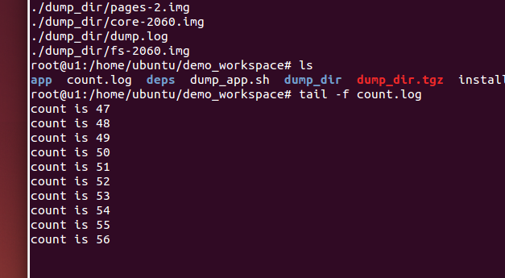
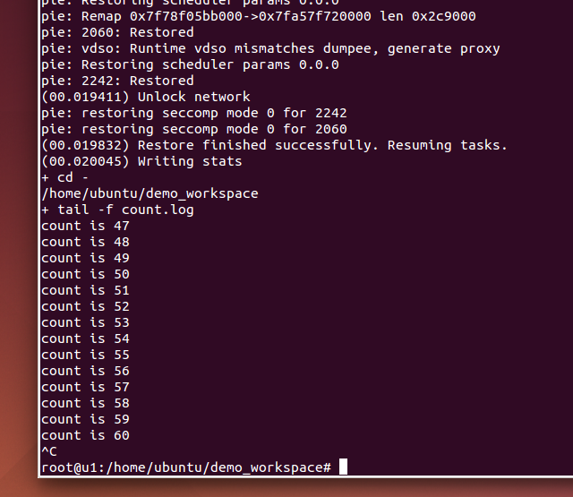

# A demo about how to freeze a process by CRIU and restore it at another LXC container
## Environment Setup

Host Linux: Ubuntu 14.04 LTS, Linux 3.16.0-62-generic #83~14.04.1-Ubuntu SMP x86_64 GNU/Linux

LXC version:

```
$ lxc-create --version
2.0.0.rc10
```
CRIU version:

```
$ criu --version
Version: 2.0
GitID: v2.0
```

## Install CRIU and LXC

### CRIU
Please visit [criu.org](https://criu.org/Installation) to learn more installation instructions.

I have written a shell script to install libraries which is install_deps.sh. And in order to install criu to a diy path, I made some modification which is at the criu.diff.

The path checkpoint/demo/criu_lxc/prepare/criu/out contains binary I have compiled and can be used directly.

The file out/lib/libnl-3.so.200 and out/lib/libprotobuf-c.so.0 can be copied into /lib/x86_64-linux-gnu/ and out/sbin/criu can be copied into /sbin/ if you want to use criu directly.

### LXC
The default lxc for ubuntu is too old to use. We need a daily lxc. The script checkpoint/demo/criu_lxc/prepare/lxc/install_lxc.sh will install a daily lxc.

The file checkpoint/demo/criu_lxc/prepare/lxc/create_container.sh will create a container named u1. The config file in /var/lib/lxc/u1/config should be modified, because in this project criu need very high privilege to dump the information of a process. I think some configuration should be highlighted, such as lxc.include should be commented, because it contains lxc.seccomp, which will block some syscalls, and lxc.mount.auto should be assigned sys:rw permissions.

The following commands will be useful.
```
lxc-start -n u1 # start u1
lxc-console -t 0 -n u1 # connect to u1
lxc-stop -n u1 # stop u1
```

If you want to copy some files into a container. One of simplest way is to copy file into /var/lib/lxc/u1/rootfs when the container is stopped.

## Demo Description
In this demo, I have written a shell program, which will count number forever and log the number in the count.log. My plan is that firstly, a process is frozen by criu and I copy all dump files and log file to another container. Then I use criu to restore the process from the dump files. If the log file grows from the checkpoint, it means the experiment succeeded. What's more all operation will be conducted by root.
### Dump
Firstly, please use checkpoint/demo/criu_lxc/deploy_lxc.sh to deploy all demo files to a container named u1.

Secondly, use start_lxc.sh to login u1. The following shell commands are used inside the container.

```
root@u1:/home/ubuntu/demo_workspace# sh start_app.sh

Then we found the pid is 2060.

+ grep count.sh
4 S root      2060  2059  0  80   0 -  1112 wait   15:33 ?        00:00:00 /bin/sh app/count.sh
0 S root      2064  2059  0  80   0 -  2937 pipe_w 15:33 console  00:00:00 grep count.sh

$sh dump_app.sh 2060

Then we got a message: (00.010178) Dumping finished successfully

```

At this moment, the process 2060 has been frozen by criu. The last number in the log file is 56 in figure 1.



### Transmission
Please modify the AIM_IP before running the copy_dump.sh.

### Restore
Please choose an another machine to do this part of experiment.

Firstly, run the deploy_dump.sh to deploy dump files in the destination container.
Then, in the container, please run sh restore_app.sh. If you see that the log has started growing, it means restore process has succeeded. The figure2 shows that the number has started growing from 56.



## Conclusion
In this experiment, I designed a demo to show how to do live migration of a process inside a Linux container. In the future, I would like to do the experiment at Docker, however some security mechanism stop criu to dump the process memory.
